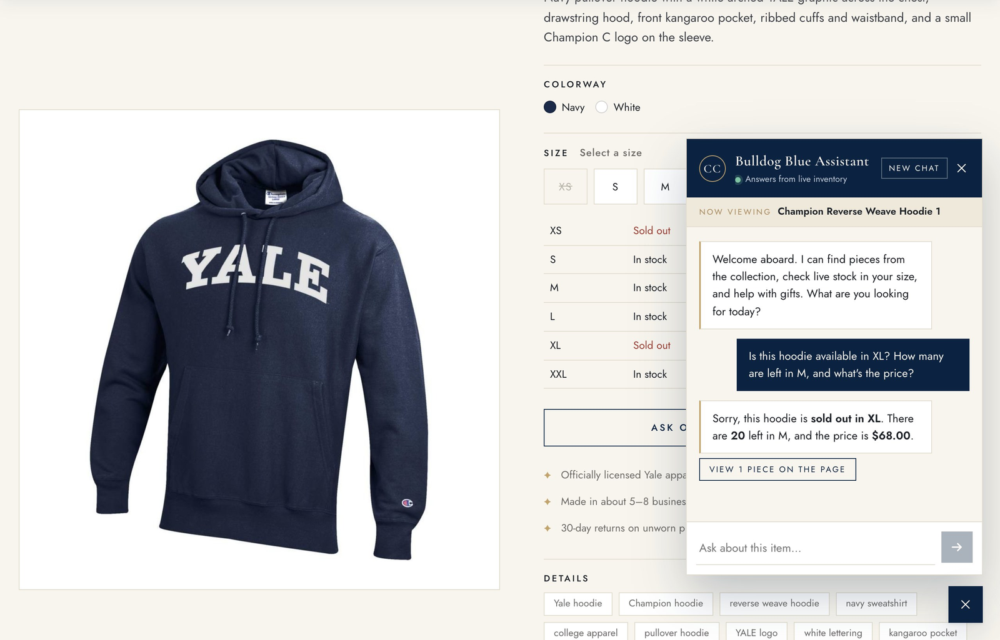

# Bulldog Blue by Campus Customs: Store + AI Stylist (HW4)

A customer-facing Campus Customs storefront with a shopping chatbot.

- **Front end:** React + Vite + TypeScript (`frontend/`)
- **Back end:** Python FastAPI (`backend/main.py`)
- **Agent:** a PydanticAI agent that answers with honest price and stock from the local
  SQLite database, puts matching products on the page as cards, remembers signed-in
  shoppers, and follows audited safety rules.



---

## 1. Get the code and place the data pack

```bash
git clone <this-repo-url> hw4
cd hw4
```

The database and product photos are **not in this repo** (they're git-ignored). Put the
provided data pack in `hw4/data/` so it looks like this:

```
hw4/
└── data/
    ├── campus_customs.db          ← provided database
    └── products/                  ← provided product photos (102 .jpg files)
        ├── basic-hoodie-big-yale.jpg
        └── …
```

## 2. Add your API key

```bash
cp .env.example .env
```

Open `.env` and set `PORTKEY_API_KEY` to your Portkey key (the agent calls `gpt-5.6-luna`
through the Portkey gateway). The key is only read from `.env`; it never appears in the code.

## 3. Run the back end (FastAPI, port 8000)

Requires **Python 3.12+**. In a terminal, from the `hw4/` folder:

```bash
python3 -m venv .venv
source .venv/bin/activate           # Windows: .venv\Scripts\activate
pip install -r requirements.txt
cd backend
uvicorn main:app --reload --port 8000
```

Check it's running: http://localhost:8000/api/health should return `{"status":"ok"}`.

On first start, the server makes white-backed copies of the product photos in the
background (about 1–9 seconds, in `data/products_display/`). Until then, the originals
are shown.

## 4. Run the front end (React + Vite, port 5174)

Requires **Node.js 20+**. In a **second** terminal:

```bash
cd frontend
npm install
npm run dev
```

Open **http://localhost:5174**. The Vite dev server forwards `/api/*` and `/images/*` to the
back end on port 8000.

> **Port 8000 already in use?** Start the back end on another port
> (`uvicorn main:app --reload --port 8001`), then start the front end with
> `BACKEND_URL=http://localhost:8001 npm run dev`.

## 5. Try it

- **Log in** with the seed test account: `test@campuscustoms.yale.edu` / `password`. Or
  create your own account.
- Open the chat (**Ask our stylist**, bottom right) and try:
  - "What hoodies do you have?" Product cards appear on the page.
  - On a product page: "Is this available in XL? How many are left in M?" You get honest
    stock and price from the database.
  - "Gift ideas for a Yale dad", or "Do you have any discount codes?"
- Browse **Shop**: carousel, category tabs, sort, pages of 12, and product pages.

---

## Project layout

```
hw4/
├── AI_prompts.md, requirements.txt, .env.example, .gitignore, README.md
├── backend/
│   ├── main.py              FastAPI app — run with: uvicorn main:app --reload --port 8000
│   │                        (products, images, accounts, chat; also prepares product photos)
│   ├── agent.py             ┐
│   ├── models.py            │ the agent: four files
│   ├── tools.py             │ (wiring + limits, Pydantic models, tools + checks, system prompt)
│   └── prompts/prompt.md    ┘
├── frontend/                React + Vite + TypeScript storefront
│   └── src/ (pages/, components/, api.ts, types.ts, index.css …)
└── output/
    ├── harness.md           how the whole system works (start here)
    ├── design.md            storefront design write-up
    ├── usability.md         front- and back-end improvements
    ├── app_check.html       site test with screenshots (open in a browser)
    ├── app_check_images/
    └── audit_trail.json     append-only log of agent activity
```

**The agent** is the four files `backend/prompts/prompt.md`, `backend/agent.py`,
`backend/tools.py` and `backend/models.py`. They import only each other (plus libraries).

## How it works (short)

1. The chat widget sends the shopper's message and the page they're on to
   `POST /api/chat/stream`.
2. The PydanticAI agent calls **read-only tools** (`search_products`,
   `get_product_details`, `check_stock`, `get_viewed_product`, `get_customer_profile`).
3. It answers with a message plus product IDs.
4. A **fact check** rejects any price, stock count or product that no tool returned, plus
   other safety rules (no card numbers, no other people's emails, no made-up discounts).
5. Python turns the IDs into real product cards on the page.
6. Every step is appended to `output/audit_trail.json`.

See **`output/harness.md`** for the models, tools, safety rules, limits and full details.

## What's not in this repo (on purpose)

- `.env` (real API key). Use `.env.example`.
- `data/`: the database and product images (place the data pack yourself; see step 1).
- `node_modules/`, `.venv/`, build output.

*Student class project inspired by yalebulldogblue.com. Not the official store. Lifestyle
photos are from Unsplash (credited on the site).*
